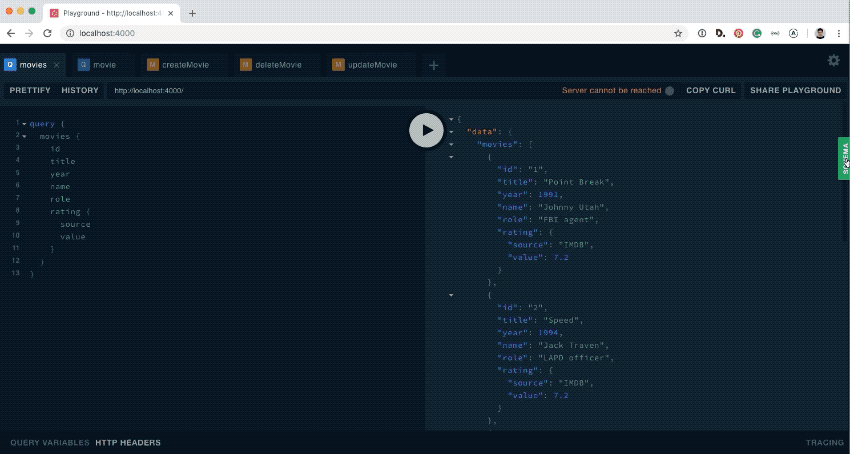

[](https://gravitydept.com/)

# GraphQL Demo



This demo is for GraphQL beginners (who already [read the docs](https://graphql.org/learn/)) to practice concepts. It uses [Graphpack](https://github.com/glennreyes/graphpack) to create a GraphQL server and setup the GraphQL Playground browser tool to interact with some data about Keanu Reeves movies.

It shows GraphQL operations:

- `Query` — read
- `Mutation` — create, update, and delete

## Key files

Look in the `/src` folder for:

- `db.json` — The small JSON file representating a database.
- `schema.graphql` — The GraphQL schema that models data structures and types.
- `resolvers.js` — The logic for responding GraphQL operations.

## Getting started

First, install [Node](https://nodejs.org) (version `10.15.0` at time of publication).

Open your terminal and run these commands:

``` bash
git clone git@github.com:gravitydepartment/graphql-demo.git
cd graphql-demo
npm install
npm run dev
```

Voila, GraphQL Playground is running at: [http://localhost:4000](http://localhost:4000)

## Example operations

In GraphQL Playground, copy/paste each snippet into a new tab and press the play button to see what happens.

### Get info for all movies:

```
query {
  movies {
    id
    title
    year
    name
    role
    rating {
      source
      value
    }
  }
}
```

### Get info for a specific movie:

```
query {
  movie (id: 3) {
    id
    title
    year
    name
    role
    rating {
      source
      value
    }
  }
}
```

### Create a movie:

```
mutation {
  createMovie (
    id: 5,
    title: "John Wick",
    year: 2014,
    name: "John Wick",
    role: "Retired hitman"
  ) {
    id
    title
    year
    name
    role
    rating {
      source
      value
    }
  }
}
```

### Delete a movie:

```
mutation {
  deleteMovie (id: 5) {
    title
    year
  }
}
```

### Update a movie:

```
mutation {
  updateMovie (
    id: 3,
    name: "Neo",
    role: "The One"
  ) {
    title
    name
    role
  }
}
```

## Troubleshooting

You can `console.log()` from inside `resolvers.js` but it won't appear in your browser's dev tools. Check your terminal for debugging output.

## Acknowledgements

This demo is based on a [GraphQL tutorial](https://dev.to/leonardomso/a-beginners-guide-to-graphql-3kjj) written by [Leonardo Maldonado](https://github.com/leonardomso).

A few bugs were fixed, and the example data was deepened to show queries on a multi-dimensional schema.
